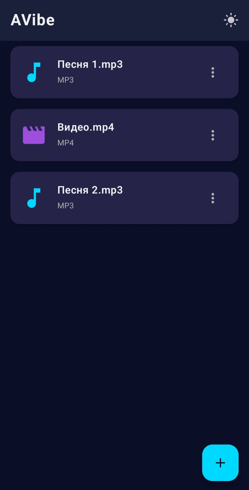
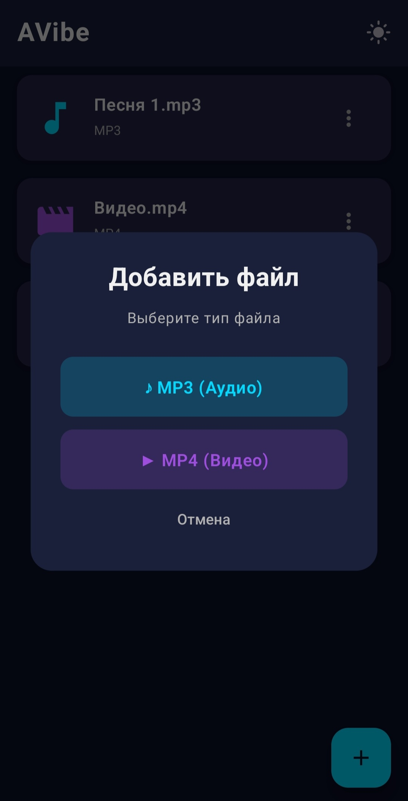
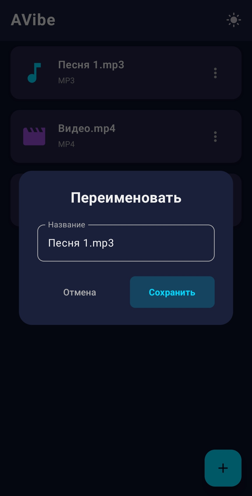
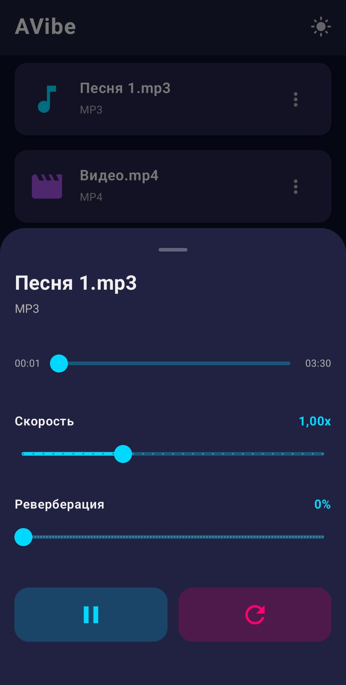
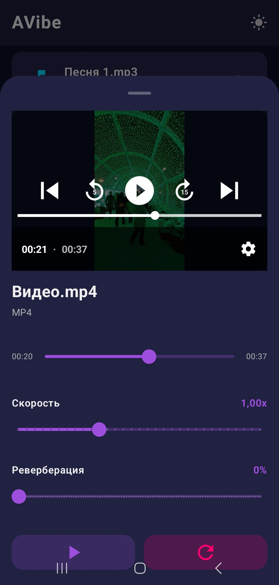
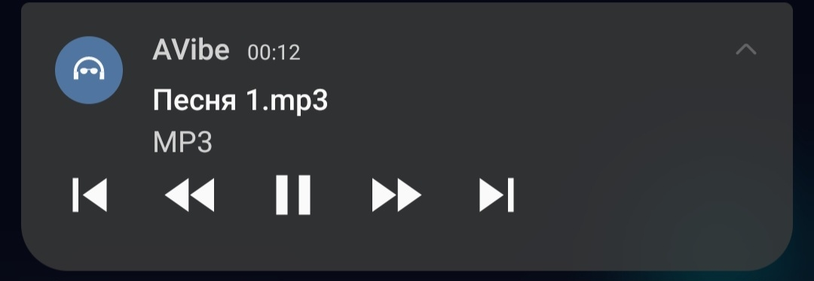
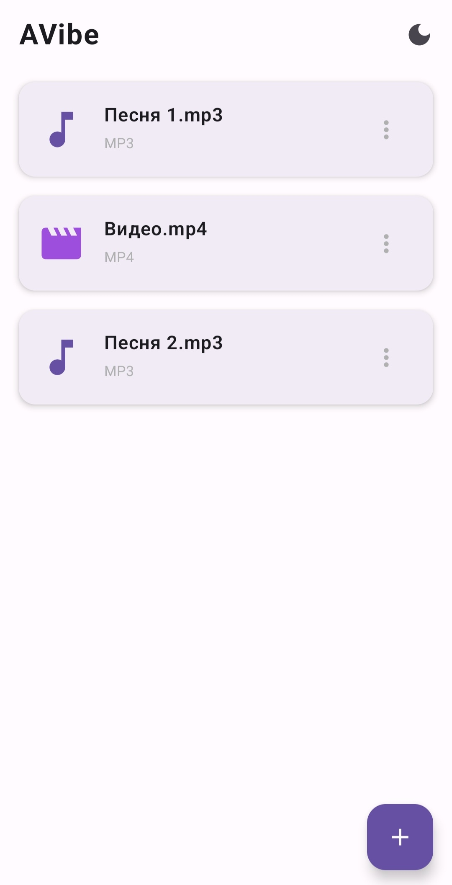
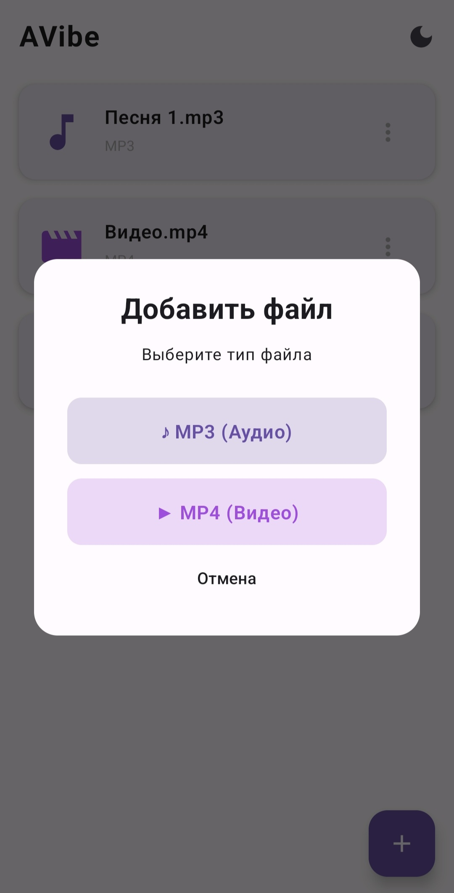
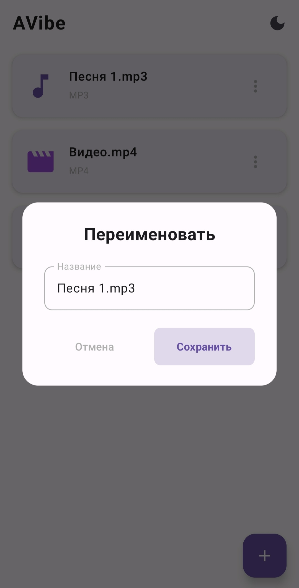
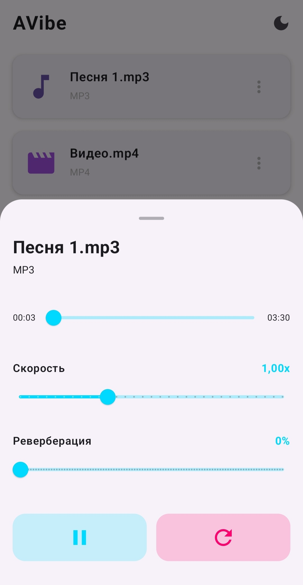

# AVibe
### Язык документации
RU | [EN](README.md) 

Android медиаплеер с эффектами slowed + reverb на основе ExoPlayer

[](https://github.com/AkaroDippens/AVibe/releases/latest)

---

## Требования
- Android 8.0 (API 26) или выше

---

## Скриншоты

### Тёмная тема

| Библиотека | Окно добавления | Окно переименования 
|------------|-----------------|--------|
|  |  | 

| Мини-плеер (Аудио) | Мини-плеер (Видео) | Уведомление
|--------------------|--------------------|--------|
|  |  | 

### Светлая тема

| Библиотека | Окно добавления | Окно переименования 
|---------|--------|--------|
|  |  | 

| Мини-плеер (Аудио)
|---------|
| 

---

## Возможности
- Воспроизведение аудио (MP3) и видео (MP4) файлов из локального хранилища
- Эффект замедления в реальном времени — скорость от 0.5x до 2x
- Эффект реверберации в реальном времени — уровень от 0% до 100%
- Постоянная медиабиблиотека, сохраняющаяся между сессиями
- Мини-плеер с быстрым управлением
- Полноэкранный плеер с перемоткой
- Уведомление с управлением воспроизведением
- Тёмная и светлая тема с сохранением выбора

> [!WARNING]
> Уровень реверберации может зависеть от устройства!

---

## Технологии
- Kotlin
- Jetpack Compose
- ExoPlayer / Media3
- DataStore Preferences
- MediaSession

---

## Начало работы
1. Склонировать репозиторий
```
git clone https://github.com/AkaroDippens/AVibe.git
```
2. Открыть в Android Studio
3. Собрать и запустить на устройстве или эмуляторе (API 26+)


Или [скачайте APK](https://github.com/AkaroDippens/AVibe/releases/latest)